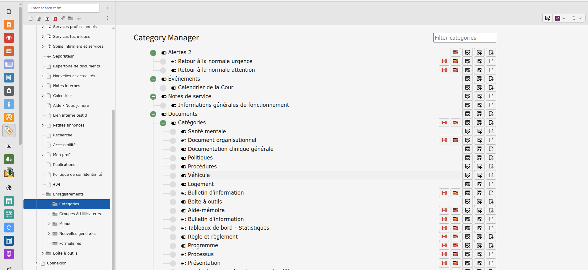

# w3c_categorymanager

## 🇫🇷 Gestionnaire de Catégories



### Description
Cette extension TYPO3 permet de gérer facilement les catégories dans une structure arborescente.  
Elle offre une interface utilisateur simplifiée pour :  
- Visualiser l’arborescence des catégories.  
- Créer et gérer des sous-catégories.  
- Activer / désactiver rapidement des catégories.  
- Gérer les traductions des catégories.
- Déplacer des catégories pour les ordonner  

### Fonctionnalités principales
- Interface en arbre avec gestion des nœuds (ouverture/fermeture).  
- Boutons d’action (Activer/désactiver, édition, ajout de sous-catégorie, traduction, déplacement).  
- Intégration avec le système natif de catégories TYPO3 (`sys_category`).  

### Installation
Installer via Composer :  
```bash
composer require w3code/w3c-categorymanager
```

### Utilisation
- Accéder au module **Category Manager** dans le backend TYPO3.  
- Naviguer dans l’arborescence.  
- Utiliser les boutons pour éditer, créer ou traduire les catégories. 
- vous pouvez trier avec le titre ascendant ou le sorting ascendant 
- vous pouvez filtrer en utilisant le champ filtrer
- en cliquant sur le bouton déplacer (il n'apparait que quand on trie avec le sorting ascendant) vou spouvez déplacer une catégorie pour changer son sorting.

---

## 🇬🇧 Category Manager


### Description
This TYPO3 extension provides an easy way to manage categories in a tree structure.  
It offers a simplified user interface to:  
- Visualize the category tree.  
- Create and manage subcategories.  
- Quickly toggle categories on/off.  
- Manage category translations.  
- Move categories to sort.

### Key Features
- Tree view interface with expandable/collapsible nodes.  
- Action buttons (edit, create subcategory, translation).  
- Integration with TYPO3’s native category system (`sys_category`).
- You can sort by title or by the sorting field
- You can filter using the input field
- If you click on the move button you can choose a target position to the category to sort it. (Only available on sort by sorting field)

### Installation
Install via Composer:  
```bash
composer require w3code/w3c-categorymanager
```

### Usage
- Open the **Category Manager** module in the TYPO3 backend.  
- Navigate through the category tree.  
- Use action buttons to edit, create or translate categories.  

### Roadmap
- Improved UI/UX (drag & drop for categories).  
- Filters and search in the tree view.  
- Extended support for roles and permissions.  
